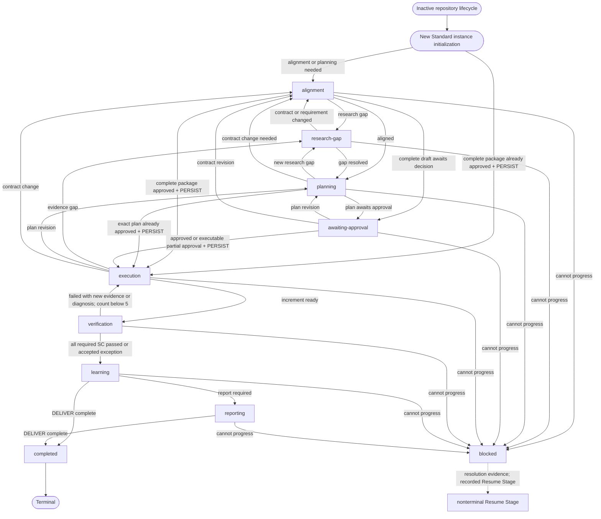

# Standard Workflow State-Machine Protocol

## Purpose and Authority

This declarative protocol applies only after Standard has been selected. It defines the Standard Stage set, entry and exit conditions, allowed actions, required State fields, legal transitions, approvals, recovery, PERSIST, DELIVER, iteration control, and State update timing.

`LOOP.md` remains the sole contract for the current Goal, Boundary / Scope, and Success Criteria. `STATE.md` records only the current instance. This protocol contains no task-specific content. Lite does not read or use this file unless it has been approved to upgrade to Standard.

`PERSIST` and `DELIVER` are atomic actions, not Stages. A logical atomic action must finish all of its listed work before its resulting Stage is recorded.

## Inactive Bootstrap Lifecycle

`inactive` is repository lifecycle metadata, not a Standard Stage. The only inactive default is `Workflow: none`, `Stage: none`, and `Status: inactive`; `Stage: none` is valid only with those two companion values. It represents a framework with no active Standard Loop and no recoverable Standard draft, and it must not contain a fabricated Goal, Success Criterion, task, plan, completion record, or deployment history.

An independent Lite task leaves this lifecycle state untouched and does not read this protocol. Starting Standard from inactive creates a new instance; it is not an `inactive -> alignment` Stage transition:

- When alignment or planning is still needed, initialize STATE with `Workflow: standard` and `Stage: alignment`, leave LOOP inactive, and keep any proposed contract and approval information only in STATE until PERSIST.
- When the user has already supplied and approved the complete Goal, Boundary / Scope, numbered Success Criteria, and implementation plan, run PERSIST directly and then enter `execution`; no transient alignment record is required.
- If the user cancels before PERSIST and no recoverable draft remains, clear the temporary Approval Context and Proposed Contract Draft, restore STATE to inactive, leave LOOP inactive, and do not update LOG.

Framework installation, migration, failed deployment, and superseded deployment never create a Loop instance or enter LOOP, STATE, or LOG.

## Stage Set and Global Rules

The only Standard Stages are `alignment`, `research-gap`, `planning`, `awaiting-approval`, `execution`, `verification`, `learning`, `reporting`, `completed`, and `blocked`.

- `completed` is terminal for the current Loop instance.
- `blocked` preserves its originating Stage and has an explicit Resume Stage.
- A Stage change requires the current Stage exit conditions and the next Stage entry conditions to be true.
- A user approval, approved plan, verified SC result, or external evidence must be recorded before a transition depends on it.
- A user rejection of an approach returns to `planning`; a rejected or changed contract returns to `alignment`. If the user declines all continuation, use `blocked` with the required resolution recorded; do not misuse `completed`.

## Legal Transition Graph

`blocked` may resume only at its recorded nonterminal Resume Stage. A new Loop is a fresh instance: after the old one is completed and logged, initialize the new instance from inactive at `alignment` or, for a complete already approved package, through PERSIST at `execution`.

## Initialization and PERSIST

### New Standard Work

From inactive, a Standard task that needs alignment or planning initializes STATE at `alignment` while LOOP remains inactive. Before approval, State may hold confirmed facts, evidence, unanswered questions, a clearly marked Draft Plan, Approval Context, and a Proposed Contract Draft. A draft is not the current Loop contract and cannot authorize execution.

If the user has already explicitly approved the complete Goal, Boundary / Scope, numbered Success Criteria, and implementation plan, validate that coverage and perform PERSIST directly without writing a transient alignment Stage.

### PERSIST Atomic Action

Use PERSIST only after the approval required for the work is recorded.

For a new Loop or an approved material contract change with full contract approval:

1. Replace inactive LOOP content, or update an approved materially changed active contract, with the approved Goal, Boundary / Scope, and numbered Success Criteria.
2. Initialize or update STATE with the approved milestone, task, approved plan, concise approval evidence in Current Judgment, steps, and the exact confirmed Active References. Preserve Work Directory only when its temporary material remains necessary.
3. Do not promote unconfirmed judgments from Work Directory into the Loop contract or approved plan.
4. Create or update Verification Status by `SC-*` identifier only, with `pending` unless evidence supports another status.
5. Clear obsolete Draft Plan, Proposed Contract Draft, and Approval Context.
6. Set Stage to `execution`.

For a self-contained partially approved subtask within an already valid Loop contract, do not rewrite `LOOP.md`; mark Plan Status `partially-approved`, preserve only the pending portion in Approval Context, limit State Steps to the approved portion, and then set or retain `execution`. A partial approval cannot write a new or materially changed Loop contract.

For an ordinary fully approved subtask within the existing Loop, do not rewrite `LOOP.md`; update only the relevant approved State fields and then set or retain `execution`.

## Reference and Work Layers

Project `AGENTS.md` maps the authority and exact paths of reference files, Human Deliverables, and Verification Evidence. Read only the specific `.agent/reference/` files required by the current task; never recursively load that directory. Record those exact file paths in STATE Active References without copying their contents.

Work is an optional temporary layer for complex research, analysis, or recovery. Create `.agent/work/<loop-id>/` only when such material must persist, record its exact path in STATE Work Directory, and never treat it as a long-term fact source or permanent project history. Human Deliverables are read only by an exact project-mapped path when the task requires their generation, update, explanation, audit, or reporting.

## Stage Protocols

### alignment

- **Purpose:** Align the Loop contract, constraints, milestone, task, and material ambiguities.
- **Entry Conditions:** New Standard work; approved Lite upgrade without a complete package; or evidence that requirements or the Loop contract need revision.
- **Allowed Actions:** Read-only inspection, clarification, evidence collection, explicitly marked draft preparation, and identification of the exact task-relevant reference files. Record exact paths in Active References; do not recursively load the reference directory. Do not implement product changes.
- **Required State Fields:** Workflow, Stage, Status, Active Milestone, Current Task, Active References, Work Directory, Current Judgment, Next Actions; add conditional draft or approval sections only when needed.
- **Exit Conditions:** Material ambiguity is resolved or explicitly awaiting a decision, and the next research/planning action is known; alternatively, the complete package is already approved.
- **Allowed Next Stages:** `research-gap`, `planning`, `awaiting-approval`, PERSIST to `execution`, or `blocked`.
- **User Approval Requirements:** Obtain approval before material Goal, Scope, or SC changes, high-impact choices, and other LOOP or AGENTS decision-boundary changes.
- **Recovery Behavior:** Preserve confirmed facts and resume from the first unresolved alignment question.

### research-gap

- **Purpose:** Resolve an external fact or repository constraint that affects the approach.
- **Entry Conditions:** Alignment, planning, or execution has identified a specific evidence gap.
- **Allowed Actions:** Conduct targeted research or audit; read only exact task-relevant reference files; record concise conclusions, evidence references, and their effect in Current Judgment. When complex material must persist, create `.agent/work/<loop-id>/` and record it in Work Directory. Do not store a research-chat transcript in State.
- **Required State Fields:** Active References, Work Directory, Current Judgment, evidence reference, unresolved question, and Next Actions.
- **Exit Conditions:** The gap is resolved, it changes the contract, or further progress is impossible.
- **Allowed Next Stages:** `planning`, `alignment`, or `blocked`.
- **User Approval Requirements:** Research itself normally needs none; findings that change the contract or cross a decision boundary return to `alignment` for approval.
- **Recovery Behavior:** Continue only the unresolved research question and retain already audited evidence.

### planning

- **Purpose:** Produce a concrete Draft Plan mapped to verification, risks, assumptions, and likely files.
- **Entry Conditions:** Alignment is sufficient and no unresolved research gap blocks a plan.
- **Allowed Actions:** Plan and assess, updating exact Active References and Work Directory when their actual use changes; do not implement product behavior.
- **Required State Fields:** Active References, Work Directory, Plan Status `draft`, Plan and Steps, Current Judgment, Next Actions, and Approval Context when a decision is ready to request.
- **Exit Conditions:** The plan is actionable and ready for approval, or a new gap or contract change is found.
- **Allowed Next Stages:** `awaiting-approval`, `research-gap`, `alignment`, PERSIST to `execution` when the exact plan is already approved, or `blocked`.
- **User Approval Requirements:** Implementation needs approval matching the actual plan unless the exact complete package was already approved.
- **Recovery Behavior:** Continue drafting from confirmed facts; do not re-open settled questions without new evidence.

### awaiting-approval

- **Purpose:** Freeze implementation while awaiting a user decision about a plan, contract, workflow upgrade, or combined package.
- **Entry Conditions:** A decision-ready Draft Plan or contract proposal exists and approval is required.
- **Allowed Actions:** Update Approval Context, add evidence, answer user questions, clarify wording that does not change plan semantics, and update Remaining Decision. Do not modify implementation, product behavior, formal delivery files, or perform irreversible or high-impact operations.
- **Required State Fields:** Plan Status `draft` or `partially-approved`, Draft Plan, Approval Context, Current Judgment, and Next Actions. A new-contract proposal also requires Proposed Contract Draft.
- **Exit Conditions:** A recorded complete approval, an independently executable partial approval within the current valid Loop contract, a requested revision, a contract change, or an inability to continue.
- **Allowed Next Stages:** PERSIST to `execution`, `planning`, `alignment`, or `blocked`.
- **User Approval Requirements:** Approval evidence is mandatory for a transition to execution. An upgrade approval and plan approval may be one decision only when it explicitly covers the new contract and complete plan.
- **Recovery Behavior:** If still pending, remain here and wait; do not repeat already answered questions or treat silence as approval.

Stay in this Stage only for evidence additions, answers, non-semantic wording clarifications, and Remaining Decision updates. Return to `planning` for a material step, expected file range, risk, dependency, verification-method, or design change. Return to `alignment` for a Goal, Scope, SC, or new critical-requirement ambiguity change. Never silently replace the reviewed Draft Plan with one of different semantics.

### execution

- **Purpose:** Implement the approved plan and perform targeted diagnostics within the approved boundary.
- **Entry Conditions:** PERSIST has completed; Plan Status is `approved`, or `partially-approved` for the recorded self-contained approved portion; approval evidence and SC rows are present. A verification return also needs new evidence or a new diagnosis.
- **Allowed Actions:** Modify implementation, run targeted checks, and update material progress or diagnosis.
- **Required State Fields:** Approved Plan or recorded approved portion, concise approval evidence in Current Judgment, Active Milestone, Current Task, Plan and Steps, Progress, Next Actions, and Verification Status; use Iteration Control only for an active unresolved verification failure.
- **Exit Conditions:** A current increment is ready for real verification, or evidence requires research, plan revision, contract revision, or a block.
- **Allowed Next Stages:** `verification`, `research-gap`, `planning`, `alignment`, or `blocked`.
- **User Approval Requirements:** No new approval within the approved boundary; stop for any newly crossed decision boundary.
- **Recovery Behavior:** Resume at the first unfinished Step and do not repeat completed work with valid evidence.

### verification

- **Purpose:** Verify observable behavior against every applicable Success Criterion.
- **Entry Conditions:** The current implementation increment is ready and its verification method is available.
- **Allowed Actions:** Run builds, tests, real operation, and user-observable checks; update each SC row with status, concise result, and evidence or reproduction path.
- **Required State Fields:** Verification Status for every applicable `SC-*`, Current Judgment, Next Actions, and Iteration Control when a failure remains unresolved.
- **Exit Conditions:** All required SC are passed or have a user-accepted exception; a failed SC has new evidence or diagnosis; or verification is blocked.
- **Allowed Next Stages:** `learning`, `execution`, or `blocked`.
- **User Approval Requirements:** A failed SC, weakened SC, or accepted exception requires explicit user approval; never self-mark it passed.
- **Recovery Behavior:** Verify only pending or unresolved rows; do not rerun passed checks unless their evidence is invalidated.

### learning

- **Purpose:** Identify lasting knowledge and prepare delivery.
- **Entry Conditions:** Verification has satisfied all required SC or recorded an explicit accepted exception.
- **Allowed Actions:** Record a current learning candidate only when it has lasting value; recommend a destination and rationale. Prepare final delivery inputs.
- **Required State Fields:** Final Verification Status, Current Judgment, Progress, and Next Actions.
- **Exit Conditions:** Learning review is complete and either a report is required or DELIVER can run.
- **Allowed Next Stages:** `reporting`, DELIVER to `completed`, or `blocked`.
- **User Approval Requirements:** Obtain approval before changing a Skill, AGENTS, Hook, or strong engineering constraint.
- **Recovery Behavior:** Resume the incomplete learning or delivery preparation; do not repeat completed verification.

### reporting

- **Purpose:** Produce a report that is an explicit task or project deliverable.
- **Entry Conditions:** Implementation verification is complete and a report is required.
- **Allowed Actions:** Build the report from evidence, State, LOG, and actual changes.
- **Required State Fields:** Current Task, Plan and Steps, Progress, Current Judgment, Next Actions, and unchanged Verification Status.
- **Exit Conditions:** The required report is complete, or reporting cannot progress.
- **Allowed Next Stages:** DELIVER to `completed` or `blocked`.
- **User Approval Requirements:** Require acceptance only when the report contract says so.
- **Recovery Behavior:** Continue unfinished report work. A report failure does not change passed implementation SC to failed.

### completed

- **Purpose:** Preserve the final delivered record for this Loop instance.
- **Entry Conditions:** DELIVER has completed; all required SC are passed or have an explicit accepted exception; any required report is complete; LOG is updated.
- **Allowed Actions:** Read-only review or administrative preparation for a fresh new-Loop initialization.
- **Required State Fields:** Stage, Status, concise Progress containing delivery summary and LOG reference, final Verification Status, Current Judgment containing limitations and accepted-exception evidence, Next Actions `none`, and Blockers `none`.
- **Exit Conditions:** None.
- **Allowed Next Stages:** None.
- **User Approval Requirements:** A new Loop follows normal contract approval rules. Its initialization is a new instance, not a transition from `completed`.
- **Recovery Behavior:** Do not repeat completed work or verification.

### blocked

- **Purpose:** Pause safely when no further meaningful progress is possible.
- **Entry Conditions:** Any nonterminal Stage lacks a required fact, permission, dependency, or user decision.
- **Allowed Actions:** Record the blocker, perform only safe work that can resolve it, and update resolution evidence.
- **Required State Fields:** Blockers plus Blocked Context: Blocked From Stage, Required Resolution, Resume Stage, and Resolution Evidence.
- **Exit Conditions:** Required Resolution is met and its evidence is recorded.
- **Allowed Next Stages:** Only the recorded nonterminal Resume Stage.
- **User Approval Requirements:** Determined by Required Resolution; silence is never approval.
- **Recovery Behavior:** Remain blocked until the recorded resolution is satisfied. Do not default to execution.

## Verification Repair Iteration Control

Track a failure by `Active Failure = SC identifier + stable failure signature`. The first failed verification creates the conditional Iteration Control section at `0`.

1. A transition from `verification` to `execution` needs new verification evidence or a new diagnosis and a recorded repair hypothesis.
2. Increase Meaningful Iterations immediately before returning from a repair attempt to `verification`, only when that attempt produced a substantive modification, new evidence, or new diagnosis.
3. Repeating an unchanged command, changing model configuration, or merely re-entering a Stage is neither an iteration nor permission for another retry.
4. After the fifth meaningful repair still fails, do not start a sixth attempt for the same Active Failure. Return to `planning` for an approach change, `alignment` for a contract change, or `blocked` when an external condition or user decision is required.
5. Reset or clear the section only when the failure passes, an approved contract makes its SC inapplicable, or evidence proves a materially different failure and records Reset Reason. Interruptions, wording edits, and stage changes do not reset it.

## DELIVER Atomic Action

Run DELIVER only from `learning`, or from `reporting` when a report is required and complete. Before setting `completed`:

Before DELIVER completes, classify and clean all Work Directory content.

1. Route durable conclusions that future Agents may rely on to an appropriate exact reference file.
2. Route formal human-facing output to the project-mapped Human Deliverables location; keep current contract, State, and result data in LOOP, STATE, and LOG; delete temporary material with no lasting value.
3. Remove the current Loop's temporary work directory after routing is complete and restore Work Directory to `none`.
4. Generate the final delivery summary.
5. Preserve final SC results, limitations, accepted exceptions and their evidence, and the LOG reference in State.
6. Update `LOG.md` with only its minimal completion index; do not copy human reports or temporary research into it.
7. Clear obsolete temporary information, including resolved Iteration Control, resolved Blocked Context, stale drafts, and stale model recommendations.
8. State a user-executable acceptance method and any remaining actions.
9. Confirm whether any remaining item is an accepted limitation or requires a follow-up Loop.
10. Set Stage to `completed` only after every DELIVER responsibility above is complete.

Without a report: `learning -> DELIVER -> completed`. With a report: `learning -> reporting -> DELIVER -> completed`.

## Interruption Recovery

On a Standard re-entry:

1. Read `AGENTS.md`.
2. Read `LOOP.md`.
3. Read this protocol.
4. Read `STATE.md`.
5. If STATE is inactive, validate the inactive bootstrap conditions instead of Stage fields. Do not recover or invent a Standard task; start a new instance only when a new Standard task is selected.
6. Otherwise validate the current Stage, its required fields, SC references, required approval evidence, blocked context, iteration control, and completed conditions against the protocol and LOOP.
7. Continue from the first unfinished exit condition of the current Stage.
8. Do not repeat completed verified work.

If State is incomplete or conflicts with LOOP, stop and explain the discrepancy to the user. Do not infer missing approval, contract content, evidence, or a Resume Stage.

## Minimum State Update Timing

Update State when a Stage changes; a user approves, partly approves, rejects, or requests revision; Current Judgment materially changes; Active References or Work Directory changes; an approved plan changes; a milestone or key Step finishes; an SC result changes; a blocker appears or resolves; work is about to be interrupted; or a model recommendation is worth preserving across context.

Do not update State for every ordinary command, repeated read, temporary output, or micro-progress that changes neither the recovery point nor the current judgment.

## Future Hook Candidates

Future Hooks may mechanically validate Stage values and transitions, required conditional fields, approval evidence before execution, PERSIST ordering, SC references, iteration limits, blocked recovery fields, DELIVER preconditions, and terminal completed behavior. They must not replace semantic judgment about alignment, evidence quality, root-cause identity, or approval coverage.
